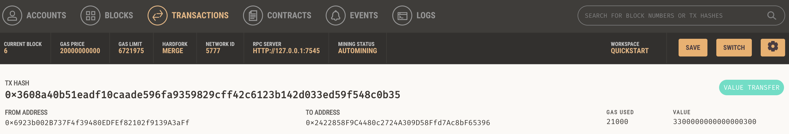
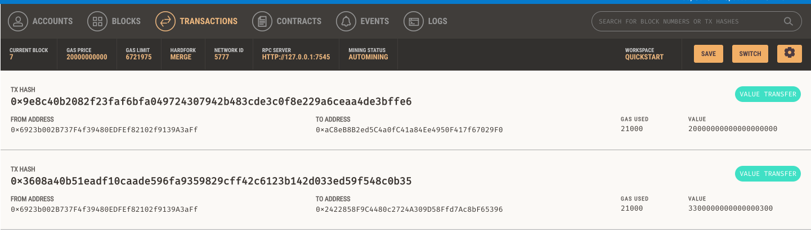

# Crypto-wallet-interface
CryptoWallet Interface is a user-friendly web app for Ethereum-based wallet interactions. Using Python's Web3 and BIP44, it enables digital wallet creation, balance checks, and secure transactions on the Ganache blockchain. It's a seamless bridge between traditional finance and decentralized cryptocurrency management."

## Screenshots

### Screenshot 1

### Screenshot 2

### Screenshot 3

### Screenshot 4

(Note: Replace "screenshot1.png" and "screenshot2.png" with the actual filenames of your screenshots if they are different.)

---

Feel free to delve into the code or test out the application. Feedback and contributions are always welcome!
